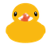
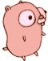

# Go Game

A top down shooting game. 
Written in `go`. 
Inspired by [Risk of Rain](https://en.wikipedia.org/wiki/Risk_of_Rain). 
Using the [ebiten](https://github.com/hajimehoshi/ebiten) engine for the game objects and the game rendering.  

# How to run
You can run this game by building the go app `go build .` or run the go app directly `go run .`

# Controls
`mouse right` hold it to shoot the laser beam. 
`w/z` hold to thrust forward. 
`a/q` turn the ship left. 
`s` hold to thrust backward. 
`d` turn the ship right. 
`p` pause the game.

# Special enemies
 other programming languages are the main enemies. 
 lootbox with random powerup. 
 a rubber duck carrying a random gun. 

# Permanent Powerups
- *Health* heal or increase health. 
- *Firerate* increase firerate. 
- *Movement* increase movement speed. 
- *Laser Speed* increase bullet speed. 

# Temporary Powerups
- *Detect Boxes* detect lootboxes locations form a limited time. 
- *Invincible* take no damage for a small period of time. 
-  *Insta Kill* kill enemies instantly. 
-  *Vampire Mode* gain back damage done to enemies.

# Guns
- *Default* standard single shot laser. 
- *Shotgun* shoots lasers in a scattered pattern. 
- *Homing Lasers* will follow the nearest enemy. 
- *Piercing Lasers* will pierce the enemy. 
- *Double Lasers* shoots 2 parallel lasers. 
- *Exploding Lasers* will explode in multiple lasers with damage halved at impact.
